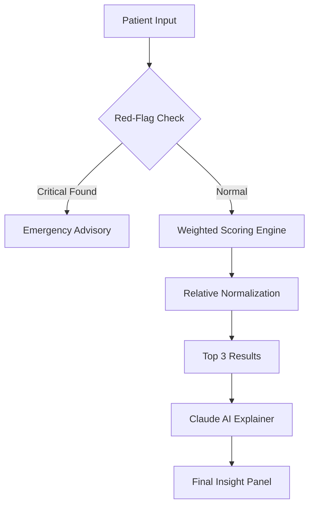

# SymptomSense - Production-Grade Health Informatics System


## Overview

**SymptomSense** is a technically rigorous, production-ready healthcare assistant designed to bridge the gap between symptom awareness and clinical understanding. By leveraging a high-fidelity weighted scoring engine and the advanced reasoning of **NVIDIA NIM API** with **Google Gemma 4 (31B)**, SymptomSense provides users with deterministic condition matching followed by structured AI-generated insights.

Built as a showcase for **Advanced Health Informatics**, this system prioritizes clinical safety, data integrity, and architectural rigor over simple prototype-style matching.

---

## Technical Features

### 1. Multi-Factor Scoring Engine
Unlike naive match-count algorithms, SymptomSense implements a **Weighted Composite Scoring Engine**:
- **Symptom Weighting**: Integrated registry assigns individual weights to symptoms based on clinical significance (e.g., chest pain vs. runny nose).
- **Severity Scaling**: User-designated severity (1–5) provides linear scaling to the match intensity.
- **Duration Multipliers**: Discrete multipliers handle acute vs. chronic presentations, ensuring sudden onset symptoms are weighted correctly without being silenced.

### 2. Relative Normalization & Confidence Tiers
The system employs **Relative Normalization** where the top result defines the confidence ceiling (1.0). This prevents "score compression" common in absolute models and ensures confidence labels (High/Moderate/Low) are meaningful relative to the specific symptom profile provided.

### 3. Emergency Detection Pipeline
A dedicated **Red-Flag Detection Layer** runs independently of the prediction engine. If any selected symptom matches a curated set of critical conditions (e.g., loss of consciousness, paralysis), the system renders an immutable **Emergency Advisory Card** prioritised over all algorithmic results.

### 4. Explainable AI Layer
SymptomSense uses a **Separation of Concerns** architecture for its AI integration:
- **Deterministic Match**: Prediction is performed entirely by browser-side logic.
- **Structured Explanation**: Claude 3.5 Sonnet is used exclusively to explain the deterministic result, preventing the stochastic nature of LLMs from influencing the core prediction.
- **Session Caching**: In-memory caching prevents redundant API calls for identical patient profiles within a session.

### 5. Security & Reliability
- **Input Sanitization**: All patient data (age, gender, disease names) is sanitized before LLM interpolation to prevent prompt injection attacks.
- **Content Security Policy (CSP)**: Locked-down CSP headers prevent unauthorized script execution and data exfiltration.
- **Dataset Integrity**: 8-second timeout guards and post-parse validation ensure the system never operates on corrupted or incomplete datasets.
- **Structured Error Taxonomy**: Consistent error handling for network failures, API rate limiting, and dataset timeout issues.

---

## Tech Stack

- **Frontend**: React 19 + Vite
- **Styling**: Vanilla CSS + Tailwind Utility Layer (Modern Design System)
- **Icons**: Lucide React
- **Data Handling**: PapaParse (High-performance CSV Streaming)
- **AI Integration**: NVIDIA NIM API (Gemma 4 31B)
- **Security Utilities**: Custom Sanitization and Error Management layers

---

## System Architecture



---

## Getting Started

### Prerequisites
- Node.js (v18+)
- npm

### Installation

1. **Clone and Install**
   ```bash
   git clone <repository-url>
   cd HealthCare
   npm install
   ```

2. **Run Development Server**
   ```bash
   npm run dev
   ```

3. **Configure API Access**
   Access the **Settings** menu within the application to provide your NVIDIA API Key (nvapi-...). Keys are stored safely in `localStorage` and strictly governed by the application's Content Security Policy.

---

## Production Readiness Gaps

While this system is designed for high reliability, real-world deployment requires:
1. **Clinical Validation**: Peer review of the symptom weight registry and red-flag symptom set by licensed physicians.
2. **Regulatory Compliance**: Implementation of DPDP/HIPAA compliant data persistence and encryption for any stored patient history.
3. **Middleware Proxy**: Moving API calls to a Node.js backend to prevent client-side exposure of API keys (Recommended for Phase 2).

---

## Medical Disclaimer

**IMPORTANT: SymptomSense is for informational purposes only.**
It does not constitute a medical diagnosis or treatment plan. The predictions are based on statistical symptom matching and AI-generated text. Always seek the advice of a licensed physician or emergency services for any health concerns.

---

<p align="center">
  <strong>Technical Lead: SymptomSense Health Informatics Team</strong>
</p>
