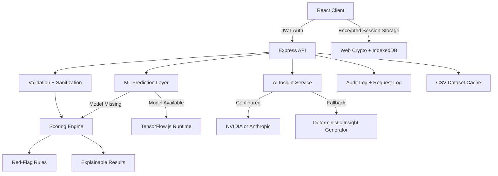

# SymptomSense

Secure, explainable symptom triage with backend-governed AI insights for production-oriented health-tech teams.

## Problem Statement

Many symptom-checking interfaces begin as browser-only prototypes. They often expose third-party API keys, mix deterministic logic with untrusted AI output, lack test coverage, and provide little operational structure for authentication, logging, or deployment. In a health-tech setting, those weaknesses create unacceptable risk.

## Solution Overview

SymptomSense has been refactored into a full-stack application with:

- An Express backend that owns all external AI provider traffic
- A modular, deterministic scoring engine with explainability output
- JWT-based authentication and backend audit logging
- Encrypted client-side storage using Web Crypto and IndexedDB
- Centralized validation, rate limiting, and structured error handling
- Unit, API, and end-to-end test coverage
- A CI workflow that installs dependencies, tests the application, and builds the frontend

## Key Features

- Backend-only AI integrations with fallback deterministic insight generation
- Weighted symptom scoring with disease confidence, coverage metrics, and evidence summaries
- Red-flag detection that escalates high-risk symptom combinations independently of ranking
- JWT session handling with encrypted browser persistence
- Cached analysis and AI insight responses for repeated requests
- Lazy-loaded React workflow components and a dark-mode interface
- Professional developer workflow with Jest, Supertest, Playwright, and GitHub Actions

## Architecture



## Tech Stack

- Frontend: React 19, Vite 8, Tailwind CSS, Lucide React
- Backend: Node.js, Express 5, Zod, Helmet, express-rate-limit, jsonwebtoken
- Data: CSV dataset parsed and cached with Papa Parse
- Security: JWT, Web Crypto API, IndexedDB-backed key storage, audit logging
- Testing: Jest, Supertest, Playwright
- CI: GitHub Actions

## Folder Structure

```text
HealthCare/
|-- .github/
|   `-- workflows/
|       `-- ci.yml
|-- backend/
|   |-- config/
|   |-- controllers/
|   |-- domain/
|   |   `-- scoring/
|   |-- middlewares/
|   |-- routes/
|   |-- schemas/
|   |-- services/
|   |   |-- ai/
|   |   |-- audit/
|   |   |-- auth/
|   |   |-- cache/
|   |   |-- dataset/
|   |   `-- ml/
|   |-- utils/
|   |-- app.js
|   `-- server.js
|-- public/
|   `-- cleaned_dataset.csv
|-- src/
|   |-- components/
|   |-- hooks/
|   |-- lib/
|   |-- services/
|   |-- App.jsx
|   `-- main.jsx
|-- tests/
|   |-- api/
|   |-- config/
|   |-- e2e/
|   `-- unit/
|-- .env.example
|-- jest.config.js
|-- playwright.config.js
|-- package.json
|-- run_dev.bat
`-- README.md
```

## Setup Instructions

### Prerequisites

- Node.js 20 or later
- npm 10 or later

### Installation

```bash
git clone <repository-url>
cd HealthCare
```

### One-Click Launch (Windows)

Use the launcher script from the project root:

```bat
run_dev.bat
```

The script automatically:

- Verifies `node` and `npm`
- Installs dependencies when `node_modules` is missing
- Creates `.env` from `.env.example` if needed
- Runs dataset processing (`clean_dataset.cjs`)
- Starts frontend and backend together (`npm run dev`)

### Manual Development (Cross-Platform)

If you are not using Windows batch scripts, run:

```bash
npm install
cp .env.example .env
node clean_dataset.cjs
npm run dev
```

This starts:

- Vite on `http://localhost:5173`
- Express on `http://localhost:4000`

Update the credentials and secrets in `.env` before running outside a local development environment.

### Production Build

```bash
npm run build
npm start
```

The backend serves the built frontend from `dist/` when a production build exists.

## Environment Variables

| Variable | Required | Description |
| --- | --- | --- |
| `NODE_ENV` | Yes | Runtime mode. Use `development`, `test`, or `production`. |
| `PORT` | Yes | Express server port. Defaults to `4000`. |
| `CLIENT_ORIGIN` | Yes | Comma-separated list of allowed browser origins. |
| `JWT_SECRET` | Yes | Signing secret for access tokens. Use a strong random value. |
| `JWT_EXPIRES_IN` | Yes | Access token lifetime, for example `8h`. |
| `AUTH_EMAIL` | Yes | Bootstrap clinician email used by the login endpoint. |
| `AUTH_PASSWORD` | Yes | Bootstrap clinician password or bcrypt hash. |
| `AI_PROVIDER` | Yes | `fallback`, `nvidia`, or `anthropic`. |
| `NVIDIA_API_KEY` | No | Required when `AI_PROVIDER=nvidia`. |
| `NVIDIA_MODEL` | No | NVIDIA model name. |
| `ANTHROPIC_API_KEY` | No | Required when `AI_PROVIDER=anthropic`. |
| `ANTHROPIC_MODEL` | No | Anthropic model name. |
| `API_RATE_LIMIT_WINDOW_MS` | No | Global API limiter window in milliseconds. |
| `API_RATE_LIMIT_MAX` | No | Maximum requests allowed during the global rate-limit window. |
| `AUTH_RATE_LIMIT_MAX` | No | Maximum login attempts allowed per window. |
| `AI_RATE_LIMIT_MAX` | No | Maximum AI insight requests allowed per window. |
| `ANALYSIS_CACHE_TTL_MS` | No | TTL for cached analysis responses. |
| `AI_CACHE_TTL_MS` | No | TTL for cached AI insight responses. |
| `AUDIT_LOG_FILE` | No | File path for persisted audit events. |
| `DATASET_PATH` | No | CSV path used by the dataset loader. |
| `ML_MODEL_PATH` | No | TensorFlow.js model artifact location. |
| `VITE_API_BASE_URL` | Yes | Frontend API base path. Defaults to `/api`. |

## API Documentation

### Authentication

#### `POST /api/auth/login`

Authenticate the clinician session and return a JWT.

Request:

```json
{
  "email": "clinician@symptomsense.local",
  "password": "StrongPassword123!"
}
```

Response:

```json
{
  "requestId": "6f014bea-6095-40c5-b980-dc706e4234f1",
  "token": "<jwt>",
  "expiresIn": "8h",
  "user": {
    "email": "clinician@symptomsense.local",
    "role": "clinician",
    "displayName": "Clinical Reviewer"
  }
}
```

### Symptom Catalog

#### `GET /api/catalog/symptoms`

Returns the deduplicated symptom catalog and relative symptom weights. Requires `Authorization: Bearer <jwt>`.

### Symptom Analysis

#### `POST /api/analyze-symptoms`

Runs the deterministic scoring engine.

Request:

```json
{
  "patient": {
    "age": 34,
    "sex": "male"
  },
  "symptoms": [
    {
      "name": "dizziness",
      "severity": 4,
      "durationDays": 2
    },
    {
      "name": "insomnia",
      "severity": 3,
      "durationDays": 7
    }
  ]
}
```

Response:

```json
{
  "requestId": "72b264f2-f361-4a9a-a22b-2ab1cbbd5d76",
  "patient": {
    "age": 34,
    "sex": "male"
  },
  "summary": {
    "analyzedAt": "2026-04-21T12:08:43.655Z",
    "symptomCount": 2,
    "diseaseCount": 219,
    "modelStrategy": "rule-engine",
    "urgent": false
  },
  "redFlags": [],
  "results": [
    {
      "disease": "Panic Disorder",
      "confidence": 0.82,
      "confidencePercent": 82,
      "confidenceLabel": "High",
      "matchedSymptoms": [
        "Dizziness",
        "Insomnia"
      ],
      "coverage": {
        "inputCoverage": 1,
        "diseaseCoverage": 0.5
      },
      "source": "rule-engine",
      "explainability": {
        "whySuggested": "Matched 2 of 2 reported symptoms with strongest evidence from Dizziness, Insomnia.",
        "topContributors": []
      }
    }
  ]
}
```

### AI Insights

#### `POST /api/ai-insights`

Generates a backend-governed educational summary for the top-ranked condition. Requires `Authorization: Bearer <jwt>`.

Request:

```json
{
  "patient": {
    "age": 34,
    "sex": "male"
  },
  "result": {
    "disease": "Panic Disorder",
    "confidence": 0.82,
    "confidenceLabel": "High",
    "matchedSymptoms": [
      "Chest Tightness",
      "Shortness of Breath"
    ],
    "whySuggested": "Matched 2 of 2 reported symptoms with strong cardiopulmonary overlap."
  },
  "redFlags": []
}
```

Response:

```json
{
  "requestId": "1f559d9d-ee9b-4a9a-bd4a-fe6aa12d6bc0",
  "provider": "fallback",
  "model": "deterministic-clinical-summary-v1",
  "generatedAt": "2026-04-21T12:08:43.675Z",
  "cached": false,
  "insight": "Panic Disorder ranked highest for this presentation with an estimated confidence of 82%..."
}
```

### Health Check

#### `GET /api/health`

Returns backend liveness metadata for local orchestration and CI checks.

## Security and Compliance Notes

- All external AI provider traffic is routed through the backend.
- API secrets are sourced from environment variables and are never stored in the frontend bundle.
- Input validation is enforced with Zod on all write endpoints.
- Rate limiting is active for global API traffic, authentication, and AI generation routes.
- Helmet is enabled for baseline API hardening.
- JWT authentication is required for symptom catalog access, analysis, and insight generation.
- Audit events are written to the configured log file for login, analysis, and insight actions.
- Browser session state is encrypted with the Web Crypto API and a non-exportable AES-GCM key stored in IndexedDB.
- This repository does not claim HIPAA, GDPR, MDR, or SaMD certification. Formal regulatory review, threat modeling, privacy impact assessment, clinician validation, and incident response controls are still required before real clinical deployment.

## ML Integration Notes

The backend exposes a `predictSymptoms(symptomsArray)` pathway through `backend/services/ml/predictionService.js`.

- If a compatible TensorFlow.js model is available at `ML_MODEL_PATH`, the backend attempts to load it.
- If no model artifact is present, or the runtime is unavailable, the system automatically falls back to the deterministic rule engine.
- The current repository favors safe deterministic operation by default.

## Performance Notes

- The dataset is parsed once and cached in memory by the backend.
- Analysis and AI insight responses use in-memory TTL caches.
- The React workflow lazy-loads core analysis screens.
- Symptom search uses deferred rendering for smoother filtering on large catalogs.

## Testing

Run all core tests:

```bash
npm test
```

Run end-to-end tests:

```bash
npm run test:e2e
```

Run lint:

```bash
npm run lint
```

## CI Pipeline

GitHub Actions runs the following on every push to `main` and on every pull request:

1. Install dependencies with `npm ci`
2. Run ESLint
3. Run Jest unit and API tests
4. Install Playwright browsers
5. Build the frontend
6. Run the Playwright end-to-end flow

## Medical Disclaimer

SymptomSense is not a diagnosis system, not a treatment recommendation engine, and not an emergency triage authority. It is an informational aid for symptom pattern review. Any user experiencing severe or rapidly worsening symptoms should seek immediate medical attention from qualified professionals.

## Future Roadmap

- Replace bootstrap email/password authentication with a managed identity provider and role-based access control
- Add clinician-reviewed symptom weights and medically validated thresholds
- Support longitudinal patient sessions with consent-aware persistence
- Introduce calibrated ML model serving with versioned model registry controls
- Add observability dashboards, distributed tracing, and security alerting

## Contribution Guidelines

1. Create a feature branch from `main`.
2. Keep frontend, backend, and tests aligned when changing API contracts.
3. Run `npm run lint`, `npm test`, and `npm run test:e2e` before opening a pull request.
4. Document any environment variable or route changes in this README.
5. Do not introduce direct browser calls to external AI providers.

## License

This project is licensed under the MIT License. See [LICENSE](./LICENSE) for the full text.
